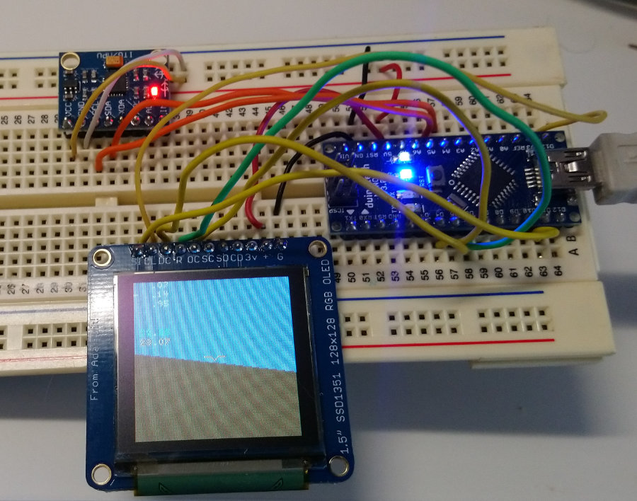

# MicroHorizon

A miniature artificial horizon built with the Arduino Nano / ATmega328P, An SSD1351 128x128 LCD, and an MPU6050 IMU.



## Build

As-is, this includes a project and configuration for CLion with the PlatformIO extension. 
It was a holiday project to experiment with this integration, but main.cpp can easily be renamed
for use in the Arduino IDE or set up with a configuration of your choice.

## Performance

Given the horizon is normally level, this implementation paints the screen in columns, blue up
to the horizon line, brown below, and tries to do these in block writes. Of course, the SSD1351
doesn't have a block write command, so while block writes result in better code performance,
you still end up transferring every pixel in the block to the device.

The original version painted every pixel on every frame, and used the Adafruit SSD1351 and MPU
libraries. These are very handy, but resulted in a measly 5.7fps.

Reducing some loop complexity and replacing the generic one-size-fits-all library calls with
calls for this specific hardware configuration improves performance to 8+fps, and various other
optimisations to reduce computation per column gets that up to about 12.9fps. 

Given the time overhead for SPI transfer, this is approaching the maximum fps for a full-screen
repaint per frame, and is still very challenging to use.

To improve performance to its current ~31fps, the rendering exploits the fact that the LCD will
hold pixel values indefinitely. It (generally) only transfers changes between each frame, between
the current horizon location (for a given vertical column) and the previous one.

An exception is made for the text section, which is repainted entirely, rather than overcomplicating
things further. 

## Orientation

The orientation of the horizon is largely controlled by the `vecForward` vector, and the choice of
axes used in computing the horizon slope, `m`. As you might imagine, these choices were driven by
the orientation of the IMU on my breadboard during development. The simplest orientation solution
is just to arrange the IMU as shown in the image.

## Hardware Configuration

This project requires an ATmega328P (ie Arduino Nano). Other devices will work, but may require
pin changes in the code.

### LCD

Not all pins are used (DC/OC were used initially with a software SPI, but performance was horrible)

```
Arduino Pin ----> LCD
13                CL
11                SI
4                 DC
5                 OC
6                 R
5V                +
GND               G
```

### IMU

The 328P uses the same wiring as the Uno for I2C, with SDA on A4 and SCL on A5.
The remaining MPU pins can be ignored for this project, resulting in a very simple setup:

```
Arduino Pin ----> MPU
5V                 5V
GND                GND
A4                 SDA
A5                 SCL
```

### Further Work

There are two glaring issues with this implementation.

* The horizon suffers from a type of gimbal lock, where the simple vector operations prove inadequate
  to rotations beyond 90 degrees. This could perhaps be resolved through some quaternion operations but
  the current behaviour in this regard is sufficient for my intended use.
* The "down" vector which drives the horizon is obtained only from acceleration forces. This is fine
  when at rest or in constant motion, but results in spurious rotations affecting the horizon when under
  acceleration. In future, employing the built-in gyro readings should make the horizon more accurate.
